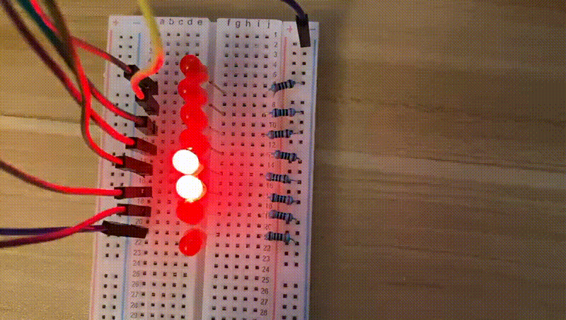
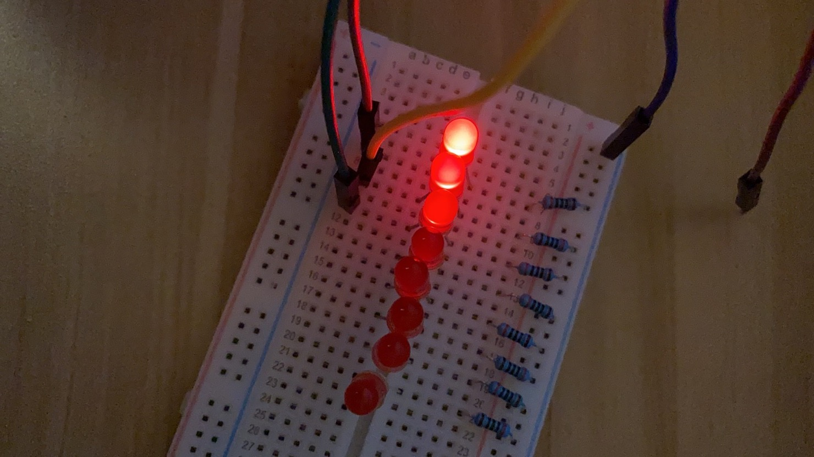
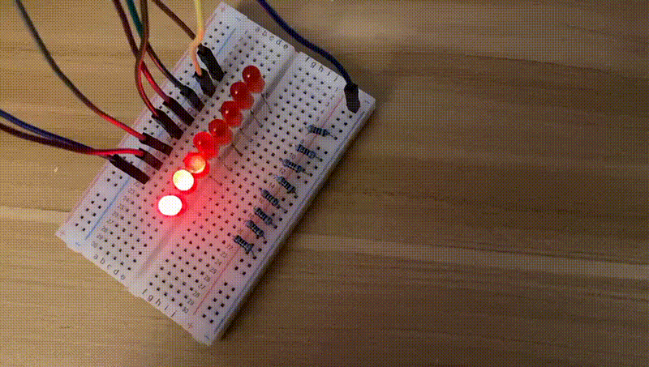

<div align="center">
  <h1>
    Computer Systems from the Ground Up
  </h1>
</div>

My study note of the awesome course [CS107E Winter 2020](http://cs107e.github.io/).

## Table of Contents

<!-- vim-markdown-toc GFM -->

* [Setup](#setup)
* [Week1: Introduction and Welcome](#week1-introduction-and-welcome)
  * [Raspberry Pi](#raspberry-pi)
  * [ARM processor and architecture](#arm-processor-and-architecture)
  * [Assignment 0](#assignment-0)
* [Week 2: ARM assembly and machine code](#week-2-arm-assembly-and-machine-code)
  * [Lab1](#lab1)
    * [Blink](#blink)
    * [Button](#button)
  * [Assignment1](#assignment1)
    * [A simple Larson Scanner](#a-simple-larson-scanner)
    * [Extended Larson Scanner](#extended-larson-scanner)
  * [From Assembly to C](#from-assembly-to-c)
* [Week 3](#week-3)
* [ARM Tips](#arm-tips)

<!-- vim-markdown-toc -->

## Setup

`source ./setup.sh`

## Week1: Introduction and Welcome

[List of electronic parts we will use in this course](https://cs107e.github.io/guides/bom/).

### Raspberry Pi

- [Pinout.xyz](https://pinout.xyz/): online website
- [Pinout.pdf](http://cs107e.github.io/guides/images/pinout.pdf): PDF document

The raspberry model we are gonna use is [Raspberry Pi 1 Model A+](https://www.raspberrypi.org/products/raspberry-pi-1-model-a-plus/).

Must stick with this version otherwise the code might not work.

The CPU model of the Pi is [BCM2835](https://www.raspberrypi.org/documentation/hardware/raspberrypi/bcm2835/README.md) (ARM11 series, ARMv6 architecture).

Check the manual here [BCM2835 Peripherals Specification](https://www.raspberrypi.org/documentation/hardware/raspberrypi/bcm2835/BCM2835-ARM-Peripherals.pdf).

You need to know that this manual __has a lot of errors__, must read it with [BCM 2835 Datasheet Errata](https://elinux.org/BCM2835_datasheet_errata#p96).

NOTE: __The address in the manual `0x7E...` is the logic address. We will change it to `0x20...` in the code__.

### ARM processor and architecture

- [Intro to ARM assembly](http://www.toves.org/books/arm/)
- [Awesome ARM tutorail from CSIE@NTU](https://www.csie.ntu.edu.tw/~cyy/courses/assembly/09fall/lectures/handouts/lec09_ARMisa.pdf)
- [VisUAL](https://salmanarif.bitbucket.io/visual/index.html): Visual ARM emulator

First, we need to install the arm toolchain for our Pi (compiler, assembler, linker, etc..) and the CP2012 driver. Check the [Installation Guide](http://cs107e.github.io/guides/install/).

After installation, we should have bunch of `arm-none-eabi` tools.

```bash
cs107e git:(master) ❯ whence -a -m 'arm-none-eabi*'
/usr/local/bin/arm-none-eabi-addr2line
/usr/local/bin/arm-none-eabi-ar
/usr/local/bin/arm-none-eabi-as
/usr/local/bin/arm-none-eabi-c++filt
/usr/local/bin/arm-none-eabi-cpp
/usr/local/bin/arm-none-eabi-elfedit
/usr/local/bin/arm-none-eabi-gcc
/usr/local/bin/arm-none-eabi-gcc-4.8.3
/usr/local/bin/arm-none-eabi-gcc-ar
/usr/local/bin/arm-none-eabi-gcc-nm
/usr/local/bin/arm-none-eabi-gcc-ranlib
/usr/local/bin/arm-none-eabi-gcov
/usr/local/bin/arm-none-eabi-gdb
/usr/local/bin/arm-none-eabi-gprof
/usr/local/bin/arm-none-eabi-ld
/usr/local/bin/arm-none-eabi-ld.bfd
/usr/local/bin/arm-none-eabi-nm
/usr/local/bin/arm-none-eabi-objcopy
/usr/local/bin/arm-none-eabi-objdump
/usr/local/bin/arm-none-eabi-ranlib
/usr/local/bin/arm-none-eabi-readelf
/usr/local/bin/arm-none-eabi-run
/usr/local/bin/arm-none-eabi-size
/usr/local/bin/arm-none-eabi-strings
/usr/local/bin/arm-none-eabi-strip
```

What is the meaning of `arm-none-eabi`? It turns out that:

> Unix cross compilers are loosely named using a convention of the form `arch[-vendor][-os]-abi`.

> The arch refers to the target architecture, which in our case is ARM. The vendor nominally refers to the
toolchain supplier. The os refers to the target operating system, if any, and is used to decide which libraries
(e.g. newlib, glibc, crt0, etc.) to link and which syscall conventions to employ. The abi specifies which
application binary interface convention is being employed, which ensures that binaries generated by different
tools can interoperate.

So `none` menas we are not targeting any operating system here, aka we are in "bare metal". And `eabi` means the ABI for the ARM architecture.

### Assignment 0

This is for the official students, I have nothing to do here 😜.

## Week 2: ARM assembly and machine code

[ARM Instruction Set Architecture](http://cs107e.github.io/readings/armisa.pdf).

From this documentation, we can know that __every ARM instruction can be conditionally executed__. This is a big difference from X86.

[ARM immediate value encoding](https://alisdair.mcdiarmid.org/arm-immediate-value-encoding/#play-with-it).

> The ARM instruction set encodes immediate values in an unusual way. It's typical of the design of the processor architecture: elegant, pragmatic, and quirky. Despite only using 12 bits of instruction space, the immediate value can represent a useful set of 32-bit constants.

Basically, instead of using 12-bit to represent a number, ARM uses 8-bit for the number and 4-bit for rotating the number. By using this approch, it can represent a large set of useful 32-bit values.

### Lab1

#### Blink

Let's give the world some light!


#### Button

Tada! 🎉 What a fun button ever! NOTE: We need to have a 10k pull-up resistor. If you are not familiar with this concept, this is a [fine explanation](https://learn.sparkfun.com/tutorials/pull-up-resistors/all).


### Assignment1

#### A simple Larson Scanner

The simple Larson scanner is easy.

1. Configure GPIO 20 ~ 27 to output mode
2. Set current gpio pin for a while then clear it
3. Update current gpio pin, need to handle the edge case
4. Go back to step 2

Here is the code [larson.s](./week2/assign1/larson.s).



#### Extended Larson Scanner

First, we need a way to control brightness. I thought about directly configuring the output voltage for a GPIO pin but it seems impossible.

So Let's do it the other way. We can control the time of the high level in a period to control the power supplied. The more power, the brighter LED. Actually this is a standard technique called [Pulse Width Modulation](https://en.wikipedia.org/wiki/Pulse-width_modulation).

Let's try that, implement a simple test in [brightness.s](./week2/assign1/brightness.s).

We decrease the duty cycle (time of high level in the period) for GPIO 20, 21 and 22 one by one and see if their brightness have any difference.



Yes they do! So the implementation of extended Larson scanner is obvious now.

Check the code [larson-extended.s](./week2/assign1/larson-extended.s).



### From Assembly to C

- [Compiler Explorer](https://gcc.godbolt.org): A neat interactive tool to see translation from C to assembly

After writing some ARM assembly code and switching to using C, this is the first time I ever think that C is so so so superior and powerful!

Long live C!

> C is quirky, flawed, and an enormous success — Dennis Ritchie

> C gives the programmer what the programmer wants; few
restrictions, few complaints — Herbert Schildt

> C: A language that combines all the elegance and power of assembly
language with all the readability and maintainability of assembly
language — Unknown

A sample Makefile for compiling base-metal C for ARM:

```makefile
NAME = myprogram
CFLAGS = -Og -Wall -std=c99 -ffreestanding
LDFLAGS = -nostdlib -e main

.PRECIOUS: %.elf %.o

all : $(NAME).bin

%.bin: %.elf
	 arm-none-eabi-objcopy $< -O binary $@

%.elf: %.o
	 arm-none-eabi-ld $(LDFLAGS) $< -o $@

%.o: %.c
	 arm-none-eabi-gcc $(CFLAGS) -c $< -o $@
```

## Week 3

数码管模拟 http://www.uize.com/examples/seven-segment-display.html

## ARM Tips

- Disassemble object file: `arm-none-eabi-objdump -D input.o`.

- Disassemble binary file: `arm-none-eabi-objdump -b binary -D -marm input.bin`.
